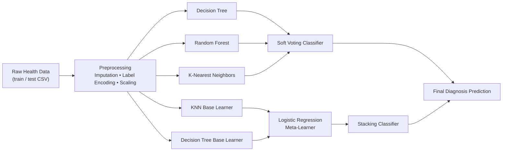

<div align="center">

# 🩺 Ensemble Learning for Vitamin Deficiency Diagnosis
### Voting Classifier vs. Stacking Classifier — A Comparative Study in Applied Machine Learning


*A multi-class classification pipeline that diagnoses nutrient deficiency risk from demographic, lifestyle, and biomarker data — built to compare how far ensemble learning can push a model beyond its individual base learners.*

</div>

---

## 📋 Table of Contents
- [Overview](#-overview)
- [Why This Project](#-why-this-project)
- [Dataset](#-dataset)
- [Pipeline Architecture](#-pipeline-architecture)
- [Methodology](#-methodology)
- [Results](#-results)
- [Key Insight](#-key-insight)
- [Tech Stack](#-tech-stack)
- [Project Structure](#-project-structure)
- [Getting Started](#-getting-started)
- [Limitations & Future Work](#-limitations--future-work)
- [Author](#-author)

---

## 🎯 Overview

This project tackles a **multi-class health classification problem**: predicting a patient's nutrient/vitamin deficiency diagnosis (5 classes) from 30+ demographic, lifestyle, and clinical biomarker features. Rather than stopping at a single model, the project is built specifically to explore and benchmark **ensemble learning strategies**:

- 🌳 Three independently trained **base learners** (Decision Tree, Random Forest, K-Nearest Neighbors)
- 🗳️ A **Soft Voting Classifier** that blends base learner probabilities
- 🧠 A **Stacking Classifier** with a Logistic Regression **meta-learner** trained on base-model outputs (via `mlxtend`)

The goal wasn't just to hit a high accuracy number — it was to rigorously compare *whether* and *when* ensembling actually helps, and to document that comparison honestly.

## 💡 Why This Project

Ensemble methods are a staple of applied ML interviews and production systems, but they're frequently used as a black-box "accuracy booster" without understanding *why* they work. This project implements both major ensembling paradigms from first principles — **parallel voting** and **layered stacking** — to build intuition for:

- How **soft voting** aggregates predicted probabilities across heterogeneous models
- How **stacking** trains a meta-model on top of base-model predictions to learn *when to trust which learner*
- Why ensembling is not a guaranteed win, and how to measure that empirically instead of assuming it

## 🗂️ Dataset

The dataset contains patient-level records with the following feature groups:

| Category | Features |
|---|---|
| **Demographics** | `age`, `gender`, `income_level`, `latitude_region` |
| **Lifestyle** | `smoking_status`, `alcohol_consumption`, `exercise_level`, `diet_type`, `sun_exposure` |
| **Body Metrics** | `bmi` |
| **Nutrient Intake (% RDA)** | `vitamin_a`, `vitamin_c`, `vitamin_d`, `vitamin_e`, `vitamin_b12`, `folate`, `calcium`, `iron` |
| **Serum Biomarkers** | `hemoglobin_g_dl`, `serum_vitamin_d_ng_ml`, `serum_vitamin_b12_pg_ml`, `serum_folate_ng_ml` |
| **Clinical Symptoms** | `symptoms_count`, `has_night_blindness`, `has_fatigue`, `has_bleeding_gums`, `has_bone_pain`, `has_muscle_weakness`, `has_numbness_tingling`, `has_memory_problems`, `has_pale_skin`, `has_multiple_deficiencies` |
| **Target** | `disease_diagnosis` — 5-class deficiency diagnosis label |

**Preprocessing applied:**
- Missing values in `alcohol_consumption` imputed using **mode imputation** (fit on train, applied consistently to test)
- Categorical columns (`gender`, `smoking_status`, `alcohol_consumption`, `exercise_level`, `diet_type`, `sun_exposure`, `income_level`, `latitude_region`, `disease_diagnosis`) encoded using `LabelEncoder`, with encoders fit only on train and reused on test to prevent leakage
- Numerical features standardized with `StandardScaler` prior to distance-based and probability-based models
- Free-text `symptoms_list` column dropped in favor of the pre-engineered binary symptom flags

## 🏗️ Pipeline Architecture



## 🔬 Methodology

**1. Voting Classifier (Soft Voting)**
Three base learners — Decision Tree, Random Forest, and KNN — are trained independently, then combined via `VotingClassifier(voting='soft')`, which averages each model's predicted class probabilities and selects the class with the highest combined confidence.

**2. Stacking Classifier**
KNN and Decision Tree act as base learners whose predicted class probabilities become engineered "meta-features." A Logistic Regression meta-learner is then trained on top of these meta-features (implemented via `mlxtend.classifier.StackingClassifier` with `use_probas=True`), learning how to optimally weight each base learner's opinion rather than averaging them blindly.

**3. Evaluation**
All models are evaluated on a held-out 20% test split (`train_test_split`, `random_state=42`) using accuracy score, allowing direct, apples-to-apples comparison between individual learners and both ensembling strategies.

## 📊 Results

| Model | Type | Accuracy |
|---|---|:---:|
| Decision Tree (`max_depth=3`) | Base Learner | 76.25% |
| K-Nearest Neighbors | Base Learner | 76.72% |
| **Random Forest** | Base Learner | **96.72%** |
| Voting Classifier (Soft) | Ensemble | 90.47% |
| Stacking Classifier (KNN + DT → Logistic Regression) | Ensemble | 93.59% |

## 🧠 Key Insight

> **Ensembling isn't automatically superior — it's only as strong as the learners feeding it.**

The standout result of this project isn't the ensemble score — it's that a single, unassisted **Random Forest (96.7%) outperformed both the Voting Classifier (90.5%) and the Stacking Classifier (93.6%)**. Random Forest's internal bagging already reduces variance so effectively that averaging it with two much weaker learners (Decision Tree and KNN, both ~76%) *pulled the ensemble average down* rather than lifting it up.

Stacking closed most of that gap versus voting (93.6% vs 90.5%) because its meta-learner can *learn* to discount a weak base learner rather than trust it equally — but neither ensemble was handed Random Forest as an input, so neither could fully recover its ceiling.

This is a deliberate, documented finding rather than an oversight: it demonstrates the difference between *knowing how to implement* ensemble methods and *knowing how to evaluate whether they were the right tool* — a distinction that matters far more in production ML than chasing a single leaderboard number.

## 🛠️ Tech Stack


## 📁 Project Structure

```
├── HEALTH.ipynb          # Full notebook: EDA → preprocessing → base models → voting → stacking
├── README.md              # Project documentation (this file)
└── requirements.txt        # Python dependencies
```

## 🚀 Getting Started

```bash
# Clone the repository
git clone https://github.com/<your-username>/<repo-name>.git
cd <repo-name>

# Install dependencies
pip install pandas numpy scikit-learn matplotlib seaborn mlxtend

# Launch the notebook
jupyter notebook HEALTH.ipynb
```

## 🔭 Limitations & Future Work

- **Include Random Forest in the ensemble inputs** — since it's the strongest individual learner, both the Voting and Stacking classifiers would likely benefit from having it as a base learner rather than only KNN + Decision Tree
- **Hyperparameter tuning** — Random Forest and Decision Tree are currently run close to default settings; a `GridSearchCV`/`Optuna` sweep would establish a fairer ceiling for comparison
- **Cross-validation** — a single train/test split can be sensitive to the random seed; k-fold CV would give more robust accuracy estimates
- **Class imbalance check** — with 5 diagnosis classes, per-class precision/recall/F1 (not just overall accuracy) would reveal whether the model is silently underperforming on rarer deficiency types
- **Feature importance / SHAP analysis** — to interpret which biomarkers and lifestyle factors drive each deficiency diagnosis, which matters for clinical trust in a health-adjacent model

## 👤 Author

**Vydhyam Vishnusai**
Machine Learning Practitioner | Building in Public

Linkedin: https://www.linkedin.com/in/vishnusai-vydhyam/

---

<div align="center">
<sub>⭐ If this project's comparative approach to ensemble learning was useful to you, consider starring the repo.</sub>
</div>
